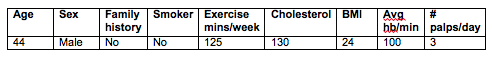

DISCLAIMER: This application is used for demonstrative and illustrative purposes only and does not constitute an offering that has gone through regulatory review.

# Create and deploy a scoring model to predict heart failure on IBM Cloud with the Watson Data Platform

In this Code Pattern, we will use a Jupyter Notebook on IBM Watson Studio to build a predictive model that demonstrates a potential health care use case.
This a customized version of the Node.js sample app that is available with the [Watson Machine Learning Service on IBM Cloud](https://cloud.ibm.com/docs/services/PredictiveModeling/index.html#WMLgettingstarted)
See the [original app](https://github.com/pmservice/predictive-modeling-samples) for a walkthrough of the source code.

When the reader has completed this Code Pattern, they will understand how to:

* Build a predictive model within a Jupyter Notebook
* Deploy the model to IBM Watson Machine Learning service
* Access the Machine Learning model via either APIs or a Nodejs app

## Flow

1. The developer creates an IBM Watson Studio Workspace.
2. Using an Apache Spark runtime for the Jupyter Notebook Kernel
3. IBM Watson Studio uses Cloud Object storage to manage your data.
4. This lab is built around a Jupyter Notebook, this is where the developer will import data, train, and evaluate their model.
5. Import data on heart failure.
6. Trained models are deployed as a web service using IBM's Watson Machine Learning Service.
7. A Node.js web app is deployed on IBM Cloud calling the predictive model hosted in the Watson Machine Learning Service.
8. A user visits the web app, enters their information, and the predictive model returns a response.

## Included components
* [IBM Watson Studio](https://www.ibm.com/cloud/watson-studio): Analyze data using RStudio, Jupyter, and Python in a configured, collaborative environment that includes IBM value-adds, such as managed Spark.
* [Jupyter Notebook](https://jupyter.org/): An open source web application that allows you to create and share documents that contain live code, equations, visualizations, and explanatory text.
* [PixieDust](https://github.com/pixiedust/pixiedust): Provides a Python helper library for IPython Notebook.

## Featured technologies
* [Artificial Intelligence](https://developer.ibm.com/technologies/artificial-intelligence/): Artificial intelligence can be applied to disparate solution spaces to deliver disruptive technologies.
* [Data Science](https://developer.ibm.com/technologies/data-science/): Systems and scientific methods to analyze structured and unstructured data in order to extract knowledge and insights.
* [Node.js](https://nodejs.org/): An open-source JavaScript run-time environment for executing server-side JavaScript code.

<!--
# Watch the Video
TBD
-->

# Steps

1. [Create an instance of the Watson Studio Service](#1-create-an-instance-of-the-watson-studio-service)
2. [Welcome to Watson Studio](#2-welcome-to-watson-studio)
3. [Create a project in Watson Studio and upload training data](#3-create-a-project-in-watson-studio-and-upload-training-data)
4. [Create an instance of the Watson Machine Learning Service and associate it to project](#4-create-an-instance-of-the-watson-machine-learning-service-and-associate-it-to-project)
5. [Save credentials for Watson Machine Learning Service](#5-save-credentials-for-watson-machine-learning-service)
6. [Explore the Data](#6-explore-the-data)
7. [Train a Machine Learning Model](#7-train-a-machine-learning-model)
8. [Deploy the saved predictive model as a web service](#8-deploy-the-saved-predictive-model-as-a-web-service)
9. [Deploy a Node.js test application in Cloud Foundry Runtime](#9-deploy-a-nodejs-test-application-in-cloud-foundry-runtime)

## Prerequisites

* An [IBM Cloud Account](https://cloud.ibm.com)

* An account on [IBM Watson Studio](https://dataplatform.cloud.ibm.com/)

## 1. Create an instance of the Watson Studio Service

Watson Studio is your IDE for Machine Learning and Data Science, combining opensource tools, and libraries into a unified Cloud based platform for discovering and sharing insights. For this lab we're using a Jupyter Notebook and Python for the data preparation, training, and evaluation steps of machine learning. 

1. In your browser go to the [IBM Cloud Dashboard](https://cloud.ibm.com/) and click `Catalog`. 

2. In the navigation menu at the left, select `AI` and then select `Watson Studio`.

  

3. Verify this service is being created in the `Dallas region`, and you've selected the `lite/free` pricing plan.

Note the `lite/free` plan only allows you to add a single user to your project, and is limited in the compute capacity hours.  More details on limits and how to monitor usage is available in the [documentation](https://dataplatform.cloud.ibm.com/docs/content/admin/monitor-resources.html?context=analytics&linkInPage=true).

  

4. Click `Create`

5. Launch your newly created Watson Studio Environment by clicking `Get Started`

  
 
 
## 2. Welcome to Watson Studio

IBM Watson Studio is a collaborative environment with AI tools that you and your team can use to collect and prepare training data, and to design, train, and deploy machine learning models.

Ranging from graphical tools you can use to build a model in minutes, to tools that automate running thousands of experiment training runs and hyperparameter optimization, Watson Studio AI tools support popular frameworks, including: TensorFlow, Caffe, PyTorch, and Keras.

You can think of Watson Studio AI tools in four categories:

* Visual recognition
* Natural language classification
* Machine learning
* Deep learning

Documentation is available [here](https://dataplatform.cloud.ibm.com/docs/content/getting-started/welcome-main.html?context=analytics)

#### Overview Landing Page

  
  
   1. **Projects** - Organize resources used when working with data; here you see your most recently updated projects
   2. **Tools** - Quick links to commonly used Data Science and ML Tools including RStudio, Data Refinery, Jupyter Notebooks, or a Visual Neural Network Model Builder
   3. **Catalog** - Create and manage data policies for managed or connected data resources
   4. **Community** - Links to the best content found by IBM Data Scientists, including example notebooks, datasets, and tutorials
   5. **Services** - Create Watson, data, and compute services and connections. Such as Watson Visual Recognition, or Apache Spark 
   6. **Manage** - Account wide configuration, including Anaconda environments, security, catalogs, billing
   7. **Hamburger Menu** - Access to IBM Watson Studio Tools, and IBM Cloud's Dashboard and Tools
   8. **IBM Studio Menu** - Quick link to the Watson Studio welcome page
   9. **Account Profile and Settings** - Personal account settings

#### Overview Project Page

  
  
  1. **Overview** - The page you're seeing now, shows who is collaborating on the projects, and number of assets associated
  2. **Assets** - Links to each asset found within the project, broken down into categories
  3. **Environments** - Track capacity units used, and manage Anaconda environments. 
  4. **Access Control** - Manage collaborators for project
  5. **Readme** - Markdown documentation for projecct
  6. **Add to Project** - Create, connect, or import new assets to project

## 3. Create a project in Watson Studio and upload training data
A project is how you organize your resources to achieve a particular goal. Your project resources can include data, collaborators, and analytic assets like notebooks and models. Projects depends on a connection to object storage to store assets. Each project has a separate bucket to hold the project's assets. 

1. From the Watson Studio dashboard getting started display, click on `Create Project`, or `New Project` 

  

2. Select project type. There are many different tools built into Watson Studio and multiple views are built to simplify the features shown to users.  Select the `Standard Project` where all features are available, and click `Create Project`.

  
  
3. Watson Studio projects depend on Object Storage for storing project assets such as notebooks, models, and data. These project assets are created in a project specific bucket within object storage.  If you don't already have Object Storage defined you can create a new instance of the service directly from the New Project dialog. Under `Define storage` select `Add`. In the Cloud Object Storage service creation menu, accept the default options, select `Lite` and then `Create`.  

**Note:**  You cannot define two Object Storage services under the free tier of IBM Cloud; if you already have object storage defined, choose `Existing` as highlighted in the screenshot below.

  
  
  
  
  
  
4. With object storage created, or existing object storage linked, click `Refresh` allowing Watson Studio to discover the newly created service. Enter _Watson ML Demo_ as the project name and click `Create`.

5. From within the new project's `Overview` panel, click `Add to project` on the top right, selecting `Data asset`.

  

  A panel on the right of the screen appears, select `Load` and click on `Browse` to upload the data file you'll use to create a predictive model.

  

6. On your machine, browse to the location of the file [**patientdataV6.csv**](https://raw.githubusercontent.com/justinmccoy/lab-watson-studio-machine-learning/master/data/patientdataV6.csv) in this repository in the **data/** directory. Select the file and click on Open (or the equivalent action for your operating system).

Once successfully uploaded, the file should appear in the `Data Assets` section of `Assets`.

  

Congratulations, you've created a new Machine Learning Project and uploaded training data.

## 4. Create an instance of the Watson Machine Learning Service and associate it to project

Machine Learning is a service on IBM Cloud with features for training and deploying machine learning models and neural networks:

* Interfaces for building, training, and deploying models: [Python client library](https://wml-api-pyclient.mybluemix.net/), [Command line interface](https://dataplatform.cloud.ibm.com/docs/content/analyze-data/ml_dlaas_environment.html), [REST API](https://watson-ml-api.mybluemix.net/)
* Deployment infrastructure for hosting your trained models
* Hyperparameter optimization for training complex neural networks
* Distributed deep learning for distributing training runs across multiple servers
* GPUs for faster training

1. Click on `Settings` for the project, then `Add Service` under `Associate Services` and finally, select `Watson` to add a Watson service to the project.  Note there are several types of servcies we can assoicate with a project, including Dashboards, and connections to existing Apache Spark services.

  

2. Select `Machine Learning` from the list of available Watson Services.

  

**Note:** If you have an existing Machine Learning service select your `Existing` service instead of creating a new one.

  
  
3. Verify this service is being created in the `Dallas region`.

  

4. Click `Create`.

The Watson Machine Learning service is now listed as one of your `Associated Services`.

## 5. Save credentials for Watson Machine Learning Service
# PICTURES NEED UPDATED HERE

To access the Watson Machine Learning service from SDKs and within Jupyter Notebooks the credentials are necessary.  Copy down the credentials from the newly created service for use in Python later in the lab.

1. Obtain Watson Machine Learning Credentials needed for invoking APIs. The Watson Machine Learning service was created and runs on IBM Cloud. To get the Watson Machine Learning credentials access the IBM Cloud Dashboad by selecting the *Hambuger Menu* in the upper left corner and click `Dashboard`.

2. Back at the IBM Cloud Dashboard, you will be able to see all the services created during this lab.  Click on the `Watson Machine Learning Service`. 

**Note:** Your service name will vary
 

3. From within the Watson Machine Learning Service details, select `Service Credentials` from the left menu.  Click on `View Credentials` and copy the credentials for the Watson Machine Learning Service.

* Save the username, password and instance_id to a text file on your machine. You’ll need this information later in your Jupyter notebook.

## 6. Explore the Data
Before diving into the training of a machine learning model it's important to understand how your data is structured, what fields are available, if there is any missing data, and potentially any data that might not be useful that could be removed.  A quick way to preview data is with Data Refinery, a visual data exploration tool built into Watson Studio.

1. From the *Watson ML Demo* project page in Watson Studio, select the `Assets` tab then the `Refine` action to load the patient data into Data Refinery.

 

2. Understand the quality and distribution of your data using data profiler, and dozens of built-in charts, graphs, and statistics. Automatically detect data types and column classifications. Explore the data, selecting the `Profile` tab to better understand the values for the columns or features used later when building the machine learning models.

 #### Data Refinery Overview
 
 
 #### Data Refinery Data Profile
 
 
Don't spend too long exploring data during this lab, there's still a lot more to do!

## 7. Train a Machine Learning Model

* In [Watson Studio](https://dataplatform.cloud.ibm.com/) using the project you've created, click on `+ Add to project` -> `Notebook` OR in the `Assets` tab under `Notebooks` choose `+ New notebook` to create a notebook.
* Select the `From URL` tab.
* Enter a name 'Predict Heartrate Failure' for the notebook.
* Under `Notebook URL` provide the following url: [https://github.com/justinmccoy/lab-watson-studio-machine-learning/blob/master/notebooks/predictiveModel.ipynb](https://github.com/justinmccoy/lab-watson-studio-machine-learning/blob/master/notebooks/predictiveModel.ipynb)
* Select the Spark runtime with Python 3.5 .
* Click the `Create` button.

## UPDATE THIS PHOTO - Using GIPHY
  

* Place your cursor in the first code block in the notebook.

  

* Click on the `Find and Add` data icon -- see step 1 in diagram below -- and then select `Insert to code` under the file **patientdataV6.csv**. This is step 2 in diagram below. Finally select `Insert SparkSession Data Frame` -- which is step 3 in diagram below.

  

> Note:  Make sure to rename the variable to `df_data` and add `.option('inferSchema','True')\`.

  

* Goto the cell that says `Stop here !!!!` during Step 5, insert the username, password, and instance_id that you saved from your Watson Machine Learning instance into the code before running it. Do the same after Step 6 `Save model to WML Service`.

  

* Click on the `Run` icon to run the code in the cell.

  

* Move your cursor to each code cell and run the code in it. Read the comments for each cell to understand what the code is doing. **Important** when the code in a cell is still running, the label to the left changes to **In [\*]**:.
  Do **not** continue to the next cell until the code is finished running.

**Note:** Your model will have different results and accuracy due to the randomness of spliting up the training and evaluation data.

## 8. Deploy the saved predictive model as a web service

**Deploy the model as an API web service using the Watson Machine Learning SDK**

* To deploy the model using the APIs instead of using the Web UI, at Step 6.1, add the `instance_id` from yout Watson Machine Learning Service credentials.
During Step 6.2, after running the second cell, get the `model_id` and put it in the cell that follows.
Put the `deployment_id` in the cell under `Montitor the status of deployment`.
For Step 6.3, add the `scoring_url` to the cell.

**Deploy the saved predictive model as a scoring service using the web UI**

Although training is a critical step in the machine learning process, the model still needs to be packaged, fronted with an API, and deployed as a web service. Watson Machine Learning streamlines deployment of machine learning models into production.

1. Starting from the *Watson ML Demo* project view in Watson Studio, an additional asset has been added to the project. The newly trained and saved *Heart Failure Prediction Model* is now visible.

2. Select the `Heart Failure Prediction Model` asset from the project view, then select `Deployments` from the model view, and finally select `Add Deployment`. 

3. Name the deployment *Heart Failure Prediction Model Deployment* of the trained machine learning model, for packaging, and fronting with an API, and click `Save`.

4. The model is quickly packaged and deployed. Upon completion you will have a new deployment of the trained machine learning model; every trained model can have many deployments.

5. Double click on the deployed *Heart Failure Prediction Model Deployment* to see details of the deployed model in the `Overview` tab.  In addition to the details there are two additional tabs, one `Implementation`, and another `Test`.  The `Implementation` tab provides you with sample code for invoking the API from `cURL`, `Python`, `Java`, `JavaScript`, or `Scala`. 

#### Model deployment details

#### Model API implementation details

#### Sample test invoking deployed Model

**Note:** Watson Machine Learning credentials are needed for invoking APIs, use the credentials obtained above in [Step 5](#5-save-credentials-for-watson-machine-learning-service)

## 9. Deploy a Node.js test application in Cloud Foundry Runtime

Until this point in the lab, we've been working as a data scientist and data engineer, gathering data, exploring data, building models, and evaluating models. In this section of the lab we deploy an existing Node.js application that has been developed to call a Machine Learning Model deployed as `Heart Failure Prediction Model Deployment` without having to explicitly specify the Watson Machine Learning credentials in the application.

1. Click on the `IBM Cloud` button below to open create a new DevOps toolchain, that is configured to download the existing Node.js application from this repo, package it, and deploy it as a new Node.js Cloud Foundry Application in IBM Cloud.

  

**Note:**  Make sure to deploy the application to the same region and space as where the *Watson Machine Learning* service was created.

2. Create a short, unique name for the toolchain; this will also be the hostname of your app. Next click on `Create` to create a new IBM Cloud API Key, and finally click on `Deploy` to deploy the application.

  
  
**Note:** It may take a minute for the remaining fields to automatically fill in after creating the IBM Cloud API Key.

3. A Toolchain and Delivery Pipeline will be created for you to pull the app out of Github and deploy it in to IBM Cloud. Click on the `Delivery Pipeline` tile to see the status of the deployment.

  

4. Wait for the **Deploy Stage** to complete; should take less then 5 minutes. The first time won't be successful. We will configure credentials in the next steps.

  

5. Click on the *Hamburger Menu* and return to the IBM Cloud Dashboard, and double click on the newly deployed `Cloud Foundry Application`

  
  
  ~
  Select `Dashboard`
  
  
  
6. For our newly deployed Node.js app to communicate with the Watson Machine Learning Service without having to explicitly set credentials, a new connection between the app and service needs to be created. From within the Cloud Foundry App View select `Connections` and then `Create Connection`.

  

7. Select the `Watson Machine Learning Service`, and click `Connect`. Answer `Restage` to the prompt. Restaging the Node.js app, will ensure the app has access to the Watson Machine Learning credentials. 

Click `Restage`

8. With the app restaged, and the model deployed go ahead and visit the App URL and test your deployed machine learning model from a Node.js web app.

#### Example Node.js App

9. Run the app again with the following parameters.

10. Verify that the model predicts that there is not a risk of heart failure for the patient with these medical characteristics.

# Learn more

* **Artificial Intelligence Code Patterns**: Enjoyed this Code Pattern? Check out our other [AI Code Patterns](https://developer.ibm.com/technologies/artificial-intelligence/).
* **Data Analytics Code Patterns**: Enjoyed this Code Pattern? Check out our other [Data Analytics Code Patterns](https://developer.ibm.com/technologies/data-science/)
* **AI and Data Code Pattern Playlist**: Bookmark our [playlist](https://www.youtube.com/playlist?list=PLzUbsvIyrNfknNewObx5N7uGZ5FKH0Fde) with all of our Code Pattern videos
* **With Watson**: Want to take your Watson app to the next level? Looking to utilize Watson Brand assets? [Join the With Watson program](https://www.ibm.com/watson/with-watson/) to leverage exclusive brand, marketing, and tech resources to amplify and accelerate your Watson embedded commercial solution.
* **Watson Studio**: Master the art of data science with IBM's [Watson Studio](https://dataplatform.cloud.ibm.com/)
* **Spark on IBM Cloud**: Need a Spark cluster? Create up to 30 Spark executors on IBM Cloud with our [Spark service](https://cloud.ibm.com/catalog/services/apache-spark)

# License
[Apache 2.0](LICENSE)
